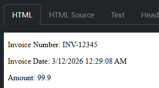
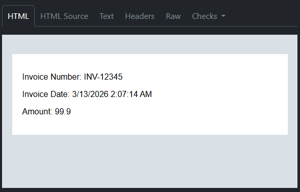

# Mittons.Messaging.Email

This project aims to create an abstraction layer for sending emails for common use cases. In addition to simplifying the setup/connection process, it provides a templating framework for sending emails with HTML content. This templating framework allows you to both template the content of a specific email as well as apply layouts to a template for consistent branding/look and feel.

## Getting Started

These instructions will get you a copy of the project up and running on your local machine for development and testing purposes. See deployment for notes on how to deploy the project on a live system.

### Manual Installation

All consumers of this library need to add the Mittons.Messaging.Email library:

```shell
dotnet add package Mittons.Messaging.Email --version 1.0.0-preview.1
```

If your project is not one that already leverages razor components (ex. console projects), you'll additionally need to add the `Microsoft.AspNetCore.Components` library:

```shell
dotnet add package Microsoft.AspNetCore.Components
```

### Configuration

Currently, the library is intended for sending emails using the SMTP protocol. This requires the following configuration settings/secrets:

* The host and port of the email server
* Whether connections should enforce SSL
* The username and password of the account sending the emails

Using the configuration pipeline of dotnet, you need to provide these details. Here is an example of what you would add to an appsettings.json file if that was your mechanism for adding the details to the pipeline:

```json
{
    "SmtpSettings": {
        "Host": "localhost",
        "Port": 1025,
        "UseSsl": false,
        "Username": "",
        "Password": ""
    }
}
```

> **Note:** The appsettings.json file should _not_ be used for the username or password values unless they are empty. They were included in the example to showcase all relevant configuration values, but in an environment where you need to authenticate, these are secrets and should be added to the configuration pipeline through a more secure configuration provider than the JSON provider.

Using the example above, you can then register the configuration with the following command:

```csharp
builder.Services.Configure<SmtpSettings>(builder.Configuration.GetSection("SmtpSettings"));
```

Your application is now configured to send emails using the [IEmailService](./src/Mittons.Messaging.Email/Services/EmailServices.cs) interface!

### Razor Templates

One of the driving forces of this library was to make it easy to create email templates. To facilitate this, we leverage the razor templating engine. This allows you to create a parameterized template for the contents of a specic email, as well as leveraging the layout aspect of razor templates to wrap the contents in a consistent branding.

#### Templates Without Layouts

For the purposes of this example, lets generate an email for an invoice that needs to render the following details:

* An invoice number
* The date the invoice was created
* The total amount of the invoice

Our end goal is a email that looks like this:



To achieve this, we can create a file named `InvoiceEmailWithoutLayout.razor` with the following contents:

```cshtml
@using Microsoft.AspNetCore.Components

<p>Invoice Number: @InvoiceNumber</p>
<p>Invoice Date: @InvoiceDate</p>
<p>Amount: @Amount</p>

@code {
    [Parameter]
    public required string InvoiceNumber { get; set; }

    [Parameter]
    public required DateTime InvoiceDate { get; set; }

    [Parameter]
    public required decimal Amount { get; set; }
}
```

With this razor template, you are now able to send an email using the [IEmailService](./src/Mittons.Messaging.Email/Services/EmailServices.cs) like this:

```csharp
emailService.SendEmailAsync<InvoiceEmailWithoutLayout>(
    subject: "New Invoice!",
    from: "no-reply@example.com",
    to: ["customer@example.com"],
    parameters: new Dictionary<string, object?>
    {
        { "InvoiceNumber": "INV-12345" },
        { "InvoiceDate": DateTime.UtcNow },
        { "Amount": 99.9m }
    }
)
```

#### Templates With Layouts

For the purposes of this example, we'll generate the same email content, but wrap it in a layout.

Our end goal is a email that looks like this:



To achieve this, we first need to create a layout template file names `DefaultEmailLayout.razor` with the following contents:

```cshtml
@inherits LayoutComponentBase

<!doctype html>
<html>
    <body style="background-color: #d9e1e7; font-family: Arial, Helvetica, sans-serif; padding-top: 30px; padding-bottom: 30px;">
        <div style="background-color: #fff; max-width: 500px; min-width: 380px; margin: auto; padding: 20px;">
            @Body
        </div>
    </body>
</html>
```

Next, we create a file named `InvoiceEmailWithLayout.razor` which wraps the contents from the previous `InvoiceEmailWithoutLayout.razor` example in a `LayoutView`:

```cshtml
@using Microsoft.AspNetCore.Components

<LayoutView Layout="@typeof(DefaultEmailLayout)">
    <p>Invoice Number: @InvoiceNumber</p>
    <p>Invoice Date: @InvoiceDate</p>
    <p>Amount: @Amount</p>
</LayoutView>

@code {
    [Parameter]
    public required string InvoiceNumber { get; set; }

    [Parameter]
    public required DateTime InvoiceDate { get; set; }

    [Parameter]
    public required decimal Amount { get; set; }
}
```

To achieve this, we can create a file named `InvoiceEmailWithoutLayout.razor` with the following contents:

```cshtml
@inherits LayoutComponentBase

<!doctype html>
<html>
    <body style="background-color: #d9e1e7; font-family: Arial, Helvetica, sans-serif; padding-top: 30px; padding-bottom: 30px;">
        <div style="background-color: #fff; max-width: 500px; min-width: 380px; margin: auto; padding: 20px;">
            @Body
        </div>
    </body>
</html>
```

#### Source Generated Extensions

While the previous examples offer simplicity, they have the potential of runtime exemptions as they trust that you pass in all the correct parameters as the correct data types. To simplify things further and provide compile-time errors, this library provides a source generator to create more specific "send" functions for templates. This is enabled by the `EmailTemplate` attribute.

Due to the nature of source generators, and the fact that `.razor` files are converted to `.cs` files with source generators, this requires the previous razor email templates (not layouts) to be split into two files: `{template}.razor` and `{template}.razor.cs`.

If we were adapting the prior `InvoiceEmailWithoutLayout` example, it would convert to the following files:

**InvoiceEmailWithoutLayout.razor**

```cshtml
<p>Invoice Number: @InvoiceNumber</p>
<p>Invoice Date: @InvoiceDate</p>
<p>Amount: @Amount</p>
```

**InvoiceEmailWithoutLayout.razor.cs**

```csharp
using Microsoft.AspNetCore.Components;
using Mittons.Messaging.Email;

namespace Namespace.Of.Razor.Component;

[EmailTemplate("InvoiceEmailWithoutLayout")]
public partial class InvoiceEmailWithoutLayout
{
    [Parameter]
    public required string InvoiceNumber { get; set; }

    [Parameter]
    public required DateTime InvoiceDate { get; set; }

    [Parameter]
    public required decimal Amount { get; set; }
}
```

These changes allow us to use the following function to send the email with more strict type checking:

```csharp
await emailService.SendInvoiceEmailWithoutLayoutAsync(
    "INV-12345",
    DateTime.UtcNow,
    99.9m,
    "Your Invoice",
    "no-reply@example.com",
    ["recipient@example.com"]
);
```

The `EmailTemplate` attribute can be applied multiple times to a class, allowing you to alias one template with multiple names.

## Running the tests

TODO: Do we need this from the template?

## Deployment

TODO: Do we need this from the template?

## Built With

TODO: Do we need this from the template?

## Contributing

TODO: Set this up to support automated additions of contributors

## Versioning

TODO: Fill this out

<!-- We use [SemVer](http://semver.org/) for versioning. For the versions available, see the [tags on this repository](https://github.com/your/project/tags). -->

## Authors

* **Kenneth Mitton** - *Initial work* - [ktmitton](https://github.com/ktmitton)

<!-- See also the list of [contributors](https://github.com/your/project/contributors) who participated in this project. -->

## License

This project is licensed under the MIT License - see the [LICENSE](LICENSE) file for details

## Acknowledgments

* [MailKit](https://github.com/jstedfast/MailKit) - The real magic behind the scenes. Without this, no emails could be sent.

* [TUnit](https://github.com/thomhurst/TUnit) - Provided a solid baseline on how to test source generators.
